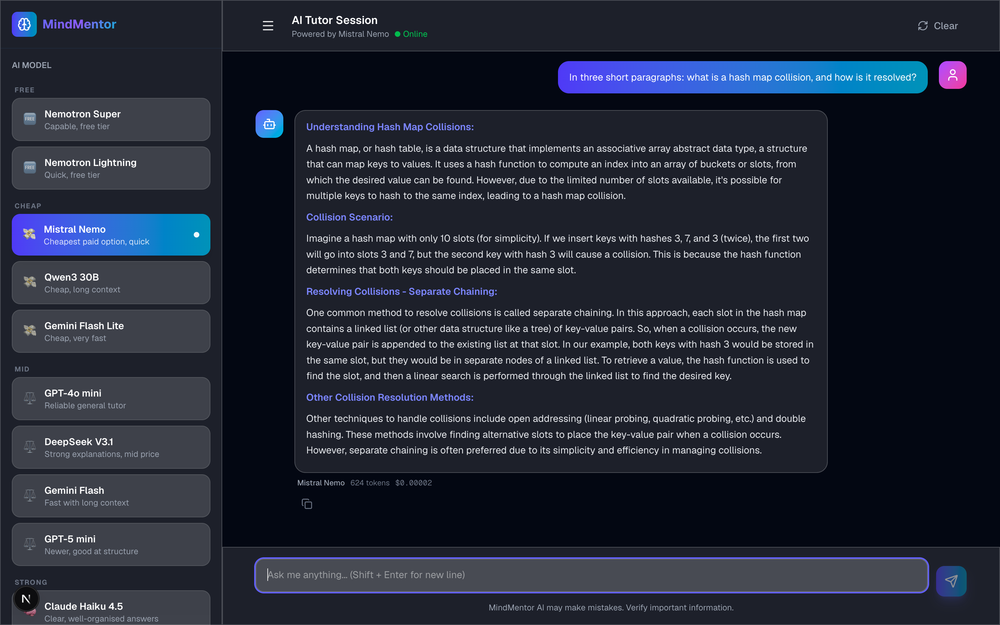

# MindMentor

An AI tutor that answers in full, remembers the conversation, lets you pick
which of twelve models answers, and tells you what each answer cost.

Next.js on the front, FastAPI on the back, every model reached through
OpenRouter with one key.



## What it does

- **Twelve models, one picker.** Free through frontier, grouped by price:
  NVIDIA Nemotron, Mistral Nemo, Qwen3, Gemini Flash Lite, GPT-4o mini,
  DeepSeek V3.1, Gemini Flash, GPT-5 mini, Claude Haiku 4.5, Claude Sonnet 5,
  GPT-5.1. The catalogue lives in `backend/models.py`, and a request is checked
  against it, so the endpoint cannot be talked into billing a model that is not
  on the list.
- **The bill, per answer.** Every reply shows the model, the tokens and the
  cost, taken from OpenRouter's own accounting rather than a price table.
  Reasoning tokens are broken out separately: they are charged at the
  completion rate and never appear in what you read. One model spent 4,220 of
  them on a single answer.
- **Fallback that does not multiply the bill.** Rate limits and upstream faults
  move to another model. A malformed request does not, because it would fail
  identically everywhere and be charged every time. Fallbacks only ever go to
  cheaper models: picking Sonnet is not consent to also be billed for GPT-5.1.
- **Answers meant to be complete.** The system prompt asks for an overview, the
  core concepts, worked examples, common pitfalls and a summary, on the
  assumption the reader may not get to ask a follow-up.
- Full conversation memory, markdown rendering, light and dark.

## There is no hosted demo, deliberately

Every message is a paid model call. A public instance would be billing my key
for anyone who found the URL, so this runs on your own key or not at all.
Screenshots are above, and the walkthrough is on
[my portfolio](https://hussainnawaz.vercel.app/projects/mindmentor-ai-tutor).

## Running it

You need an [OpenRouter](https://openrouter.ai/keys) key with a little credit.
The default model is Mistral Nemo at roughly $0.00002 a turn, so a thousand
messages costs about two cents. Two free models are in the picker as a
courtesy, but they are not the default: OpenRouter withdrew the three `:free`
slugs this project originally ran on, and free slugs rate limit under load.

```bash
cp backend/.env.example backend/.env   # then paste your key into it
```

```bash
cd backend && python3 -m venv .venv && ./.venv/bin/pip install -r requirements.txt && ./.venv/bin/uvicorn main:app --reload --port 8000
```

```bash
cd frontend && npm install && npm run dev
```

The UI is on `http://localhost:3000`, the API on `:8000`, and Swagger at
`http://127.0.0.1:8000/docs`.

## API

| Route | Method | Body | Returns |
|---|---|---|---|
| `/health` | GET | | `{ status, service }` |
| `/models` | GET | | `{ models, default }` |
| `/chat` | POST | `{ message, model, history }` | answer, model used, tokens, cost |
| `/generate` | POST | `{ prompt, model }` | single-turn, no history |

`model` is a friendly name from `/models` (`"Claude Sonnet 5"`), not an
OpenRouter id. `usage` carries the real charge:

```json
{ "model": "mistralai/mistral-nemo", "prompt_tokens": 220, "completion_tokens": 404,
  "reasoning_tokens": 0, "total_tokens": 624, "cost": 0.00002 }
```

`fallback_used` is true when the requested model could not answer and another
one did; `model_used` says which.

## Configuration

Everything lives in `backend/.env`; see `backend/.env.example`.

| Variable | Default | |
|---|---|---|
| `OPENROUTER_API_KEY` | — | required; `OPENAI_API_KEY` still works |
| `DEFAULT_MODEL_NAME` | `Mistral Nemo` | the model the picker opens on |
| `MAX_TOKENS` | `4000` | reasoning models spend part of this thinking |
| `TEMPERATURE` | `0.7` | |
| `FRONTEND_URL` | — | adds an allowed CORS origin |

The frontend reads `NEXT_PUBLIC_API_URL`, defaulting to `http://localhost:8000`.

## Layout

```
backend/
  main.py       routes, fallback loop, usage accounting
  models.py     the model catalogue and the fallback rules
frontend/
  app/page.js         landing
  app/tutor/page.js   the chat, the picker, the running cost
  lib/api.js          the calls to the backend
```

## Pages

1. **Landing** (`/`) - what it is and what it costs
2. **Tutor** (`/tutor`) - the chat, the model picker, the running cost

There used to be a dashboard, an about page and a sign-in page. All three were
mockups over invented data, as were the testimonials and the usage figures on
the landing page, so they were removed rather than left to look like features.

## Notes

Python 3.12 with FastAPI, Next.js with the App Router, Tailwind and
framer-motion. Icons are [Lucide](https://lucide.dev).

Built by [Hussain Nawaz](https://hussainnawaz.vercel.app).
